- 메인 페이지 (로그인 X)
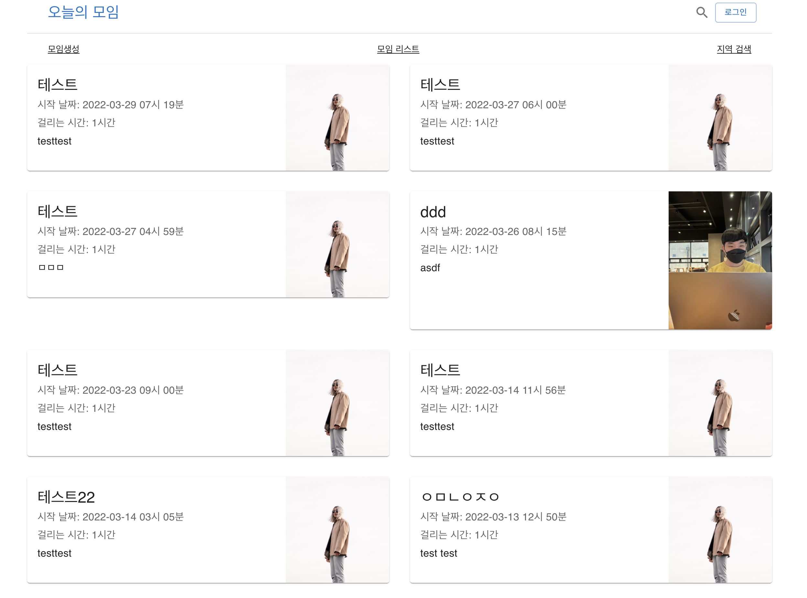

- 회원가입 페이지
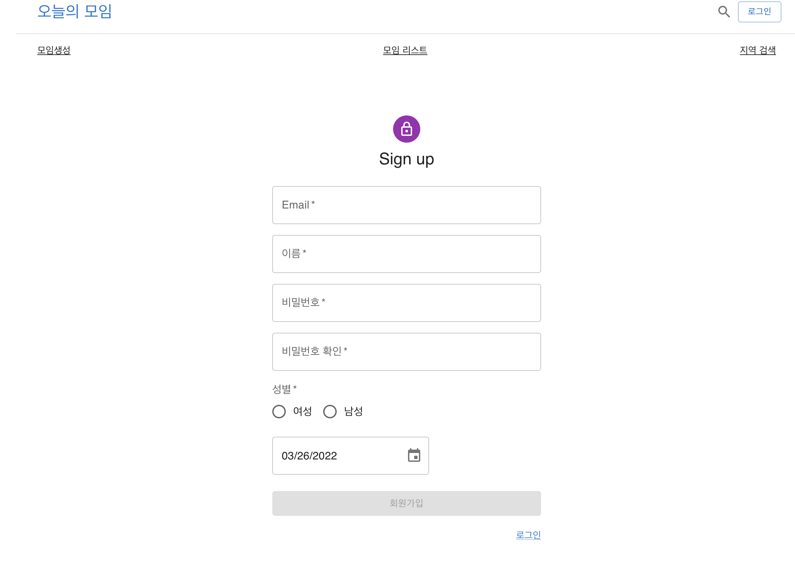

- 회원가입 페이지(날짜 선택)
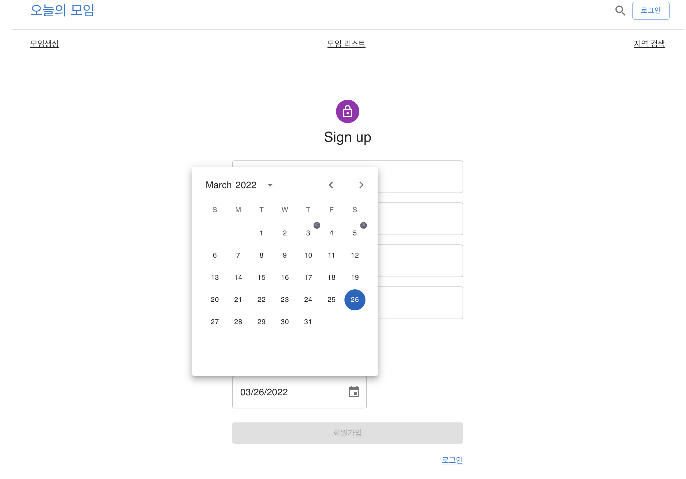

- 로그인 페이지 (이메일, 비밀번호)
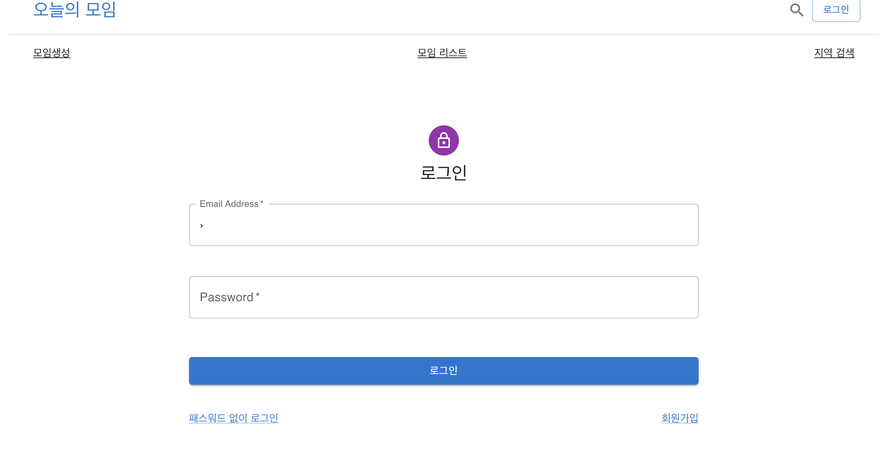

- 로그인 페이지 (이메일)
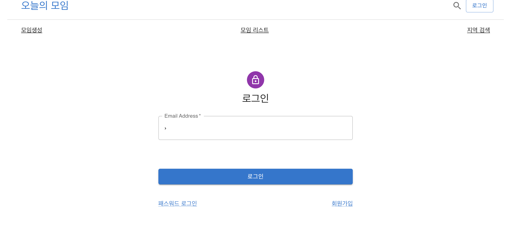

- 내 계정 설정
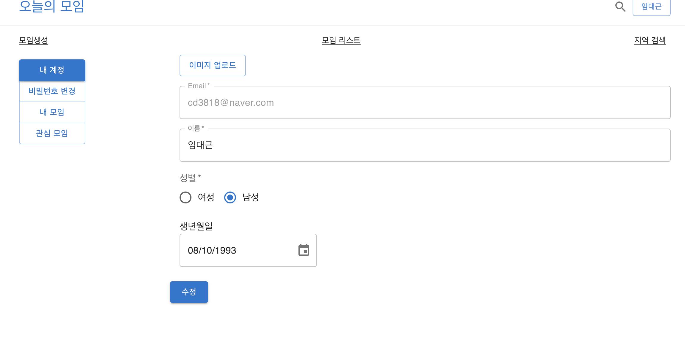

- 내 계정 설정 (비밀번호 변경)
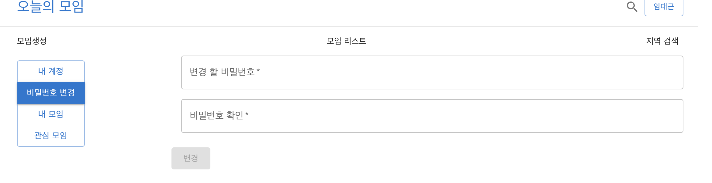

- 모임 생성 페이지
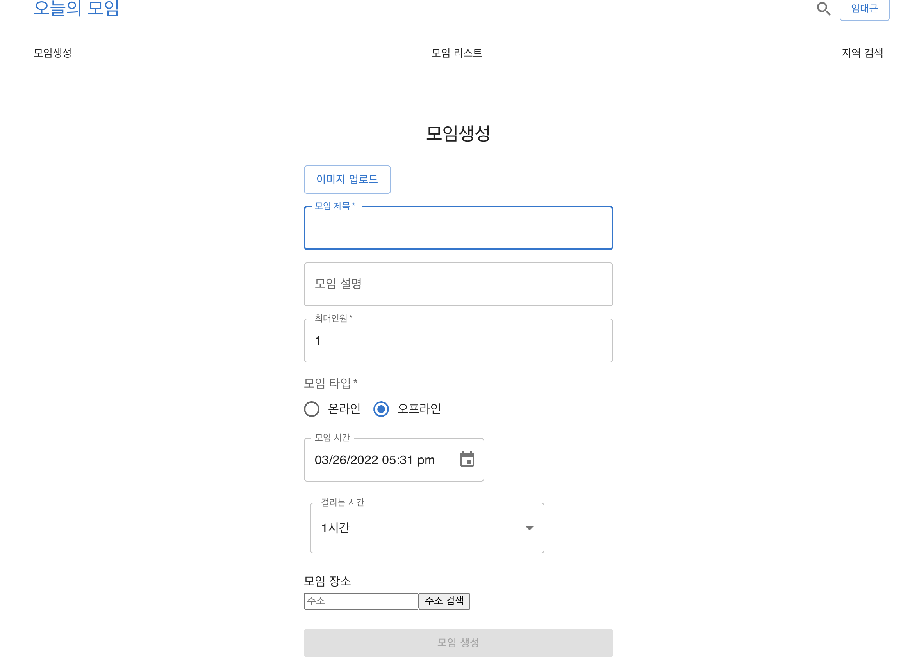

- 모임 생성 페이지 (지도)
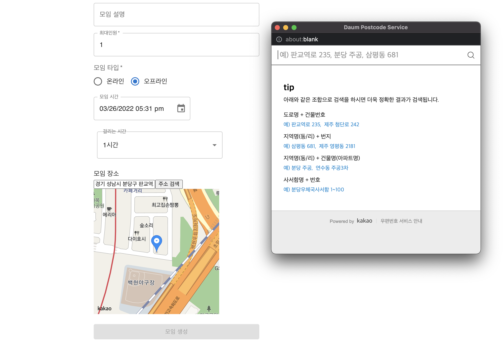

- 모임 상세 페이지
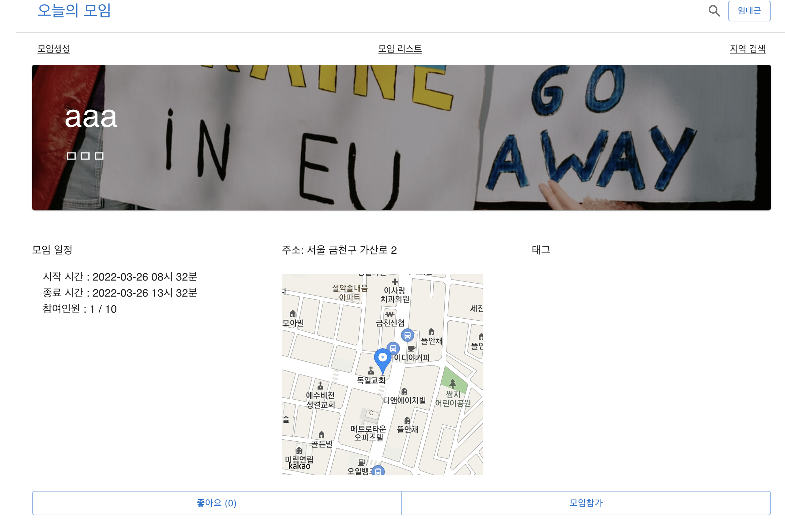

- 모임 상세 페이지 (내가 방장)
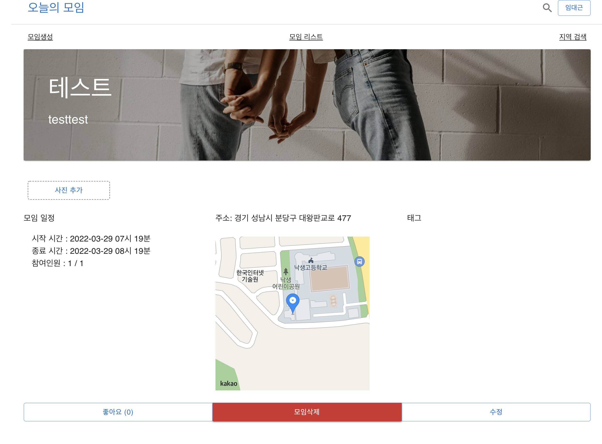

## 없는 페이지
- 알림 페이지 (ex. 상대방이 초대하면 알림이 뜨도록) / 초대 수락 및 거절 페이지