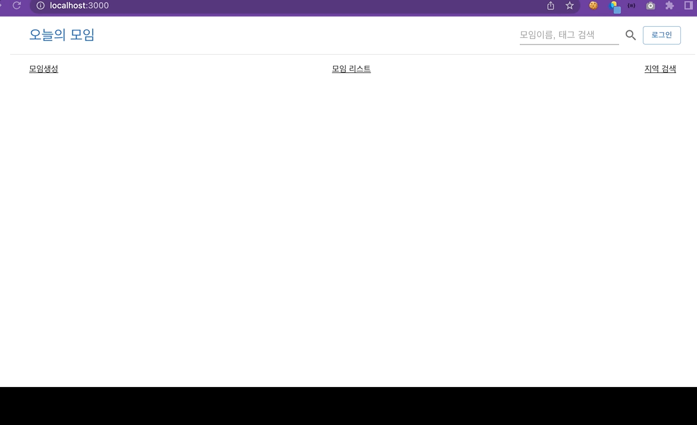
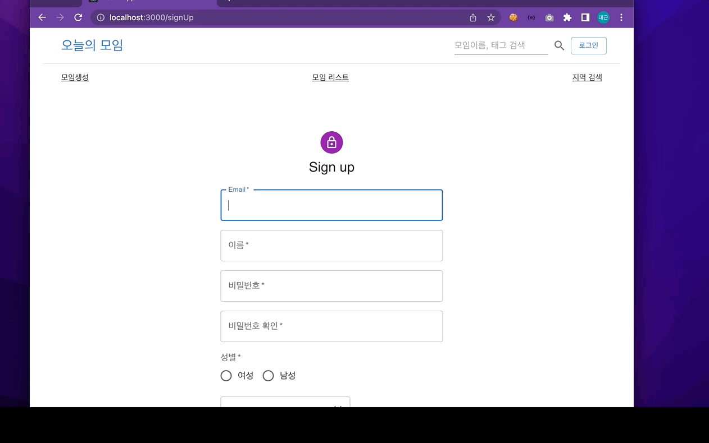
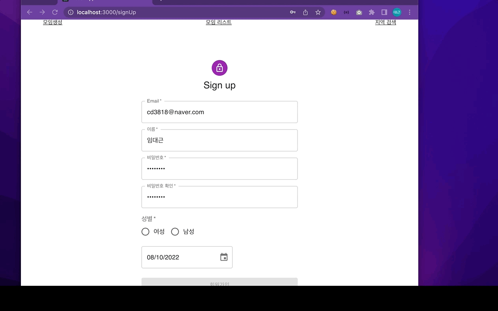
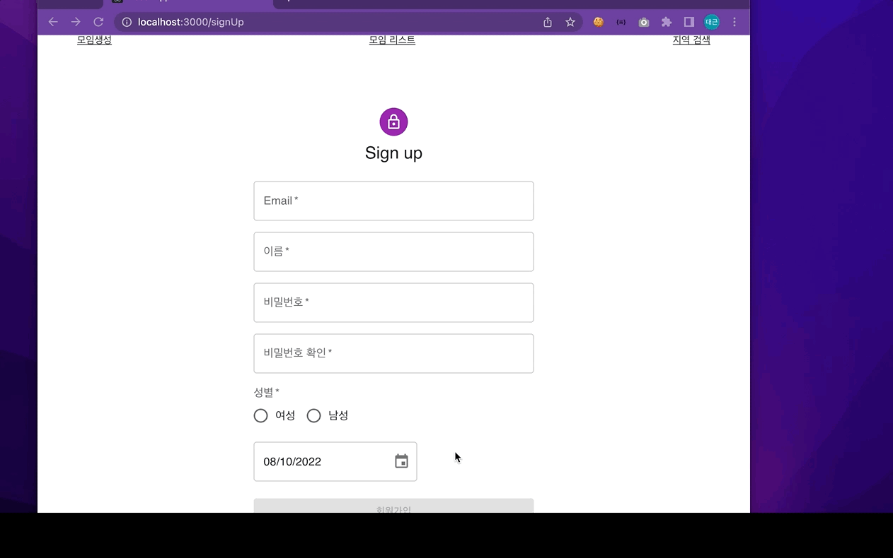
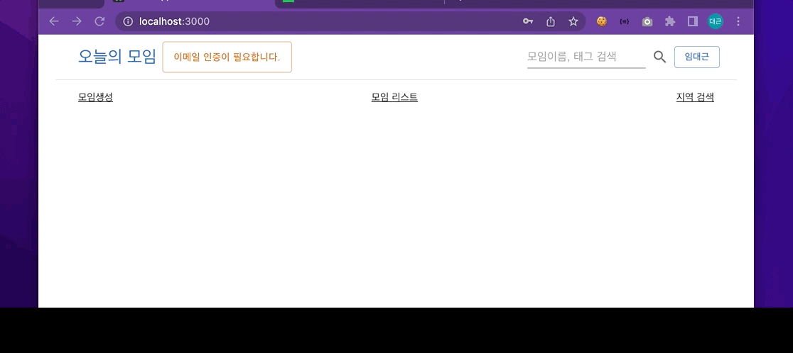
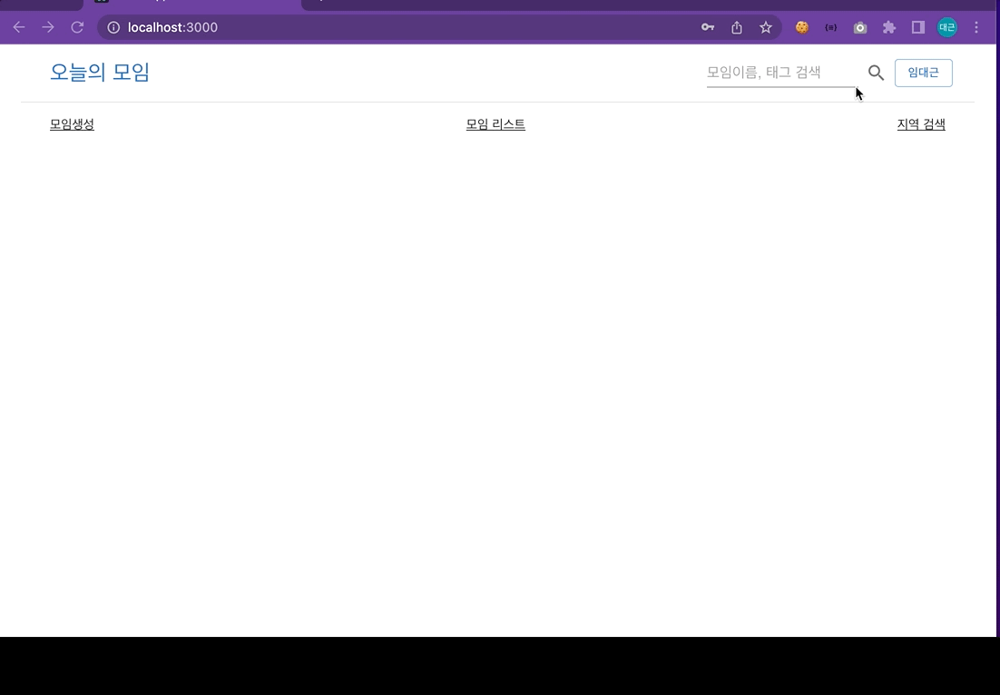
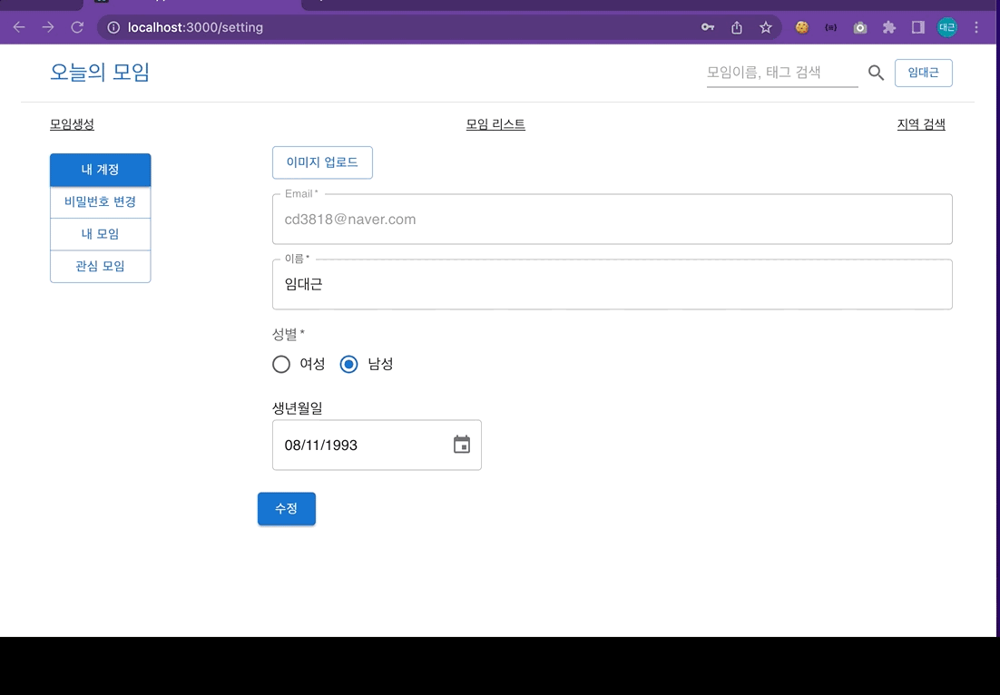
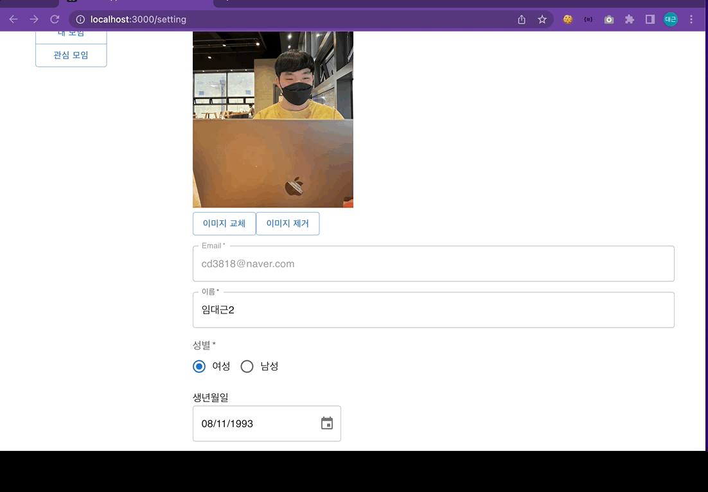
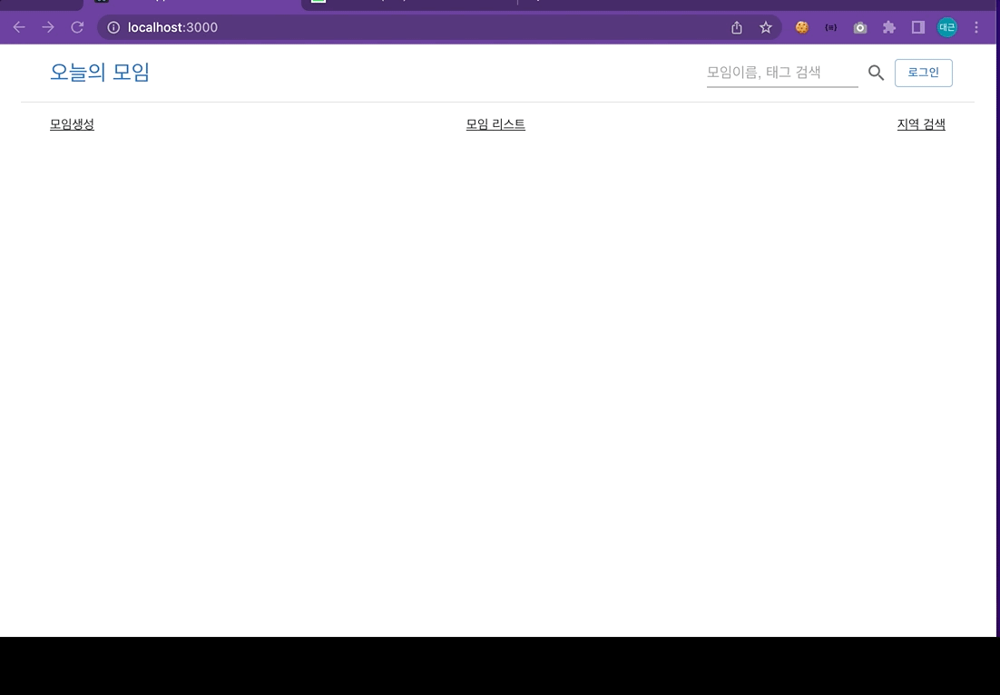
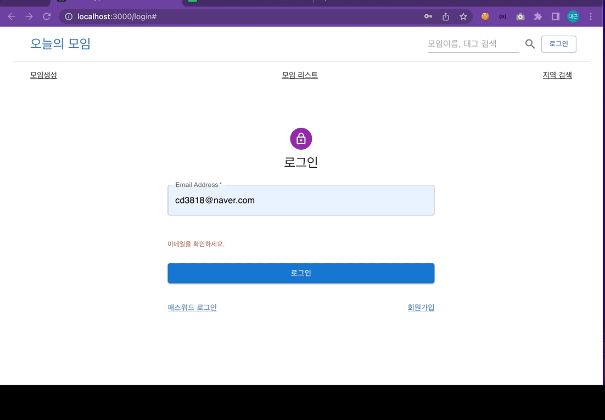

# 🙋‍♂️ Today-Assemble - 오늘의 모임 프론트엔드 서버

 

## 💡 Introduction

- 어느날 문득 영화가 보고싶었는데 같이 볼 사람이 없어서, `오늘 하루 영화 보고싶은 사람 누구 없나` 라는 생각으로 만들어본 사이트입니다.
- 1회성 간단한 모임용 웹사이트입니다.

 

## 🔖 Stack
- Front: `React.js`, `Node.js`, `Axios`, `MUI`, `KakaoMap OpenApi`
- Build: `npm`

 

## 🔖 화면

### 계정
- 회원가입화면
  1. 화면이동
    
  2. 회원가입
    
    
  3. email 중복체크
    
- 회원인증
  
- 계정정보화면
  
  - 회원정보수정
    
    
  - 비밀번호수정
    
    
  - 내가 참여중인 모임
  - 내가 `좋아요` 누른 모임
- 이메일로 로그인(비밀번호 없이)
  
  

### 모임
- 모임생성화면
- 모임상세화면
  - `좋아요` 클릭
  - 모임참여 클릭
- 모임리스트화면
- 모임수정화면
  - 이미지 추가 및 삭제
  - 모임정보수정

### 메인
- 메인화면
- 검색기능
- 지역검색 기능